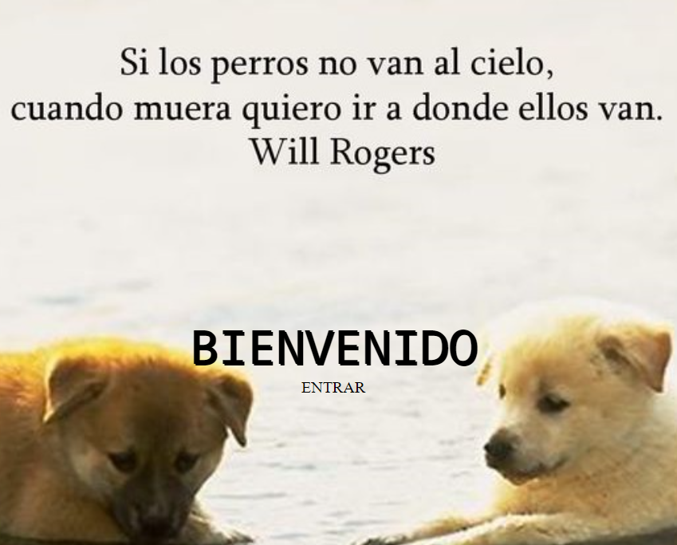

## **App de Razas Caninas - Frontend**

Aplicación que consume datos de una API (The Dog API) a través de un Backend. Se pueden realizar: búsquedas, ordenamientos y filtros, ver detalle, realizar registro.

Está versión está hecha con Redux-Toolkit.

**Tecnologías usadas**

- **JavaScript**
- **React JS**
- **Redux-Toolkit**
- **CSS**
